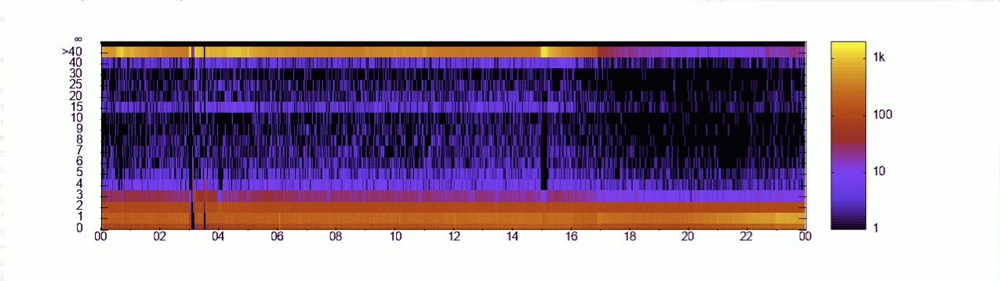

latency.awk
===

A quick way to visualize latency from access logs.  The assumption is
that the access log has the duration in µs as its final field, that is
`%D` in Apache HTTPd.
(https://httpd.apache.org/docs/2.4/mod/mod_log_config.html).

Also, we rely on the date looking something similar to `[11/Nov/2023:00:00:00 +0000]`.


Prerequisites
---
* GNU awk (`gawk`).
* Gnuplot (`gnuplot`).


Invocation
---
```
latency.awk access.log
```

Output is a heat map, by default written to stadout as
[Sixel](https://en.wikipedia.org/wiki/Sixel) escape codes.  A
commonly used terminal, iTerm2.app suuportsw this pout of the box.


Example
---



